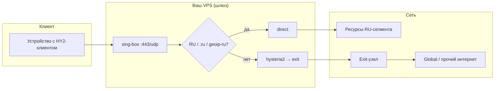

# HY2 Admin — обзор проекта

Сдержанное описание назначения, идейной основы и типичной схемы трафика. Техническая установка — в каталоге [`doc/`](doc/).

В корне репозитория — установочные скрипты и этот обзор; пошаговые инструкции — в каталоге **`doc/`**. Бинарь панели при установке подтягивается с GitHub как **[Latest release](https://github.com/AntyanMS/hy2-admin/releases/latest)** (артефакт `hy2-admin-panel`).

Исходники панели и сборка бинаря (`panel/`, `tools/build-panel-linux.sh`) — только на ветке **`dev`**; в **`main`** их нет.

---

## Зачем этот проект

**HY2 Admin** — это набор **установочных сценариев** и **веб-панели** для развёртывания стека на базе **Hysteria2**: сервер, HTTPS-панель управления пользователями и настройками, опционально — **шлюз на sing-box** с каскадом на внешние exit-узлы и раздельной маршрутизацией «локальный / RU-сегмент» против «остального трафика».

Идея: **один хост** можно поэтапно превратить из «чистого» HY2-сервера в **gateway**, где вход пользователей — sing-box, а исходящий трафик либо уходит **напрямую** с VPS (удобно для ресурсов в зоне `.ru` и совпадений по geoip-RU), либо **через каскад** на удалённые exit-узлы (типично для глобального интернета).

---

## На чём основано

| Компонент | Роль |
|-----------|------|
| [Hysteria2](https://github.com/apernet/hysteria) | Протокол и сервер; в режиме шлюза часто слушает только **localhost** как control-plane. |
| [sing-box](https://github.com/SagerNet/sing-box) | Шлюз: inbound HY2 на **443/udp**, маршруты, outbound’ы (direct / hysteria2 на exit). |
| **nginx** + **Let’s Encrypt** | HTTPS для панели и корневой «заглушки» сайта. |
| **systemd** | Сервисы `hysteria-server`, `sing-box`, `hy2-admin`, синхронизация пользователей в sing-box по **событиям** (изменение `config.yaml`). |
| Панель (**бинарь** `hy2-admin-panel`) | Управление пользователями, лимитами, каскадом, direct routing и т.д. (сборка публикуется в [Releases](https://github.com/AntyanMS/hy2-admin/releases)). |

Панель и скрипты заточены под **Linux** (Debian/Ubuntu-подобные системы), **root** при установке.

---

## Три этапа развёртывания

1. [Сервер Hysteria2](doc/INSTALLATION-SERVER.ru.md) — `install_hysteria2.sh`  
2. [Веб-панель](doc/INSTALLATION-PANEL.ru.md) — `install_hy2_admin.sh`  
3. [Шлюз sing-box](doc/INSTALLATION-GATEWAY.ru.md) — `install_singbox_gateway.sh` *(опционально)*  

---

## Трафик: RU-сегмент и Global (схема)

После включения **этапа 3** клиент подключается к **sing-box** (HY2 на VPS). Внутри sing-box действует упрощённая логика (домены `.ru` / `.su` / `.рф` и rule-set **geoip-ru** → **direct**; остальное → **каскад на exit**, если exit’ы заданы в панели).

**Кратко:**

- **RU-сегмент (в смысле правил шлюза):** трафик идёт **сразу с VPS** (`direct`), минуя каскад.  
- **Global:** трафик идёт **на exit** по HY2 (если в панели настроены узлы каскада), дальше — в интернет с точки зрения exit.

Точные правила задаются генерируемым `/etc/sing-box/config.json`; панель управляет пользователями и базой узлов (`remote_servers.json`).

### Синхронизация whitelist для direct routing (GitHub)

В панели (ветка **dev**, релиз **v0.0.5+**) на вкладке **Direct routing** можно подтянуть список доменов из внешнего открытого репозитория и применить их к правилам **direct** (включая IP по DNS):

| | |
|--|--|
| **Репозиторий** | [hxehex/russia-mobile-internet-whitelist](https://github.com/hxehex/russia-mobile-internet-whitelist) |
| **Файл** | [`whitelist.txt`](https://github.com/hxehex/russia-mobile-internet-whitelist/blob/main/whitelist.txt) (raw: `raw.githubusercontent.com/.../main/whitelist.txt`) |

Список **не входит** в состав hy2-admin: панель загружает его по запросу администратора (кнопка «Синхр. с GitHub») или по расписанию (раз в сутки, если включено автообновление). Собственные домены по-прежнему задаются в блоке **Custom**.

**Благодарность:** отдельное спасибо автору [**hxehex**](https://github.com/hxehex) и участникам проекта [russia-mobile-internet-whitelist](https://github.com/hxehex/russia-mobile-internet-whitelist) за публичный список доменов — hy2-admin лишь использует этот файл как внешний источник данных, без претензий на авторство списка.

Переопределить URL: переменная окружения `GITHUB_WHITELIST_RAW_URL` в `/opt/hy2-admin/.env`.

---

## Создатель и ссылки

| | |
|--|--|
| **Автор проекта** | **AntyanMS** |
| **Репозиторий** | [github.com/AntyanMS/hy2-admin](https://github.com/AntyanMS/hy2-admin) |
| **Профиль GitHub** | [github.com/AntyanMS](https://github.com/AntyanMS) |
| **Релизы (бинарь панели)** | [Releases](https://github.com/AntyanMS/hy2-admin/releases) |

---

## Дальше — установка

После прочтения этого обзора можно **приступить к установке**: начните с [установки сервера (этап 1)](doc/INSTALLATION-SERVER.ru.md), затем [панели (этап 2)](doc/INSTALLATION-PANEL.ru.md); шлюз sing-box — [этап 3](doc/INSTALLATION-GATEWAY.ru.md), если он вам нужен.

---

*Документ описывает замысел и типичную топологию; фактическое поведение зависит от ваших конфигов, узлов каскада и версии скриптов.*
