## Знакомство с интерфейсом HY2 Admin

HY2 Admin — это удобная панель управления, где всё под рукой.
Предлагаем ознакомиться с основными экранами и возможностями интерфейса:

---

### 1. Подключение сервера
> Просто введите параметры — и HY2 Admin готов к работе!

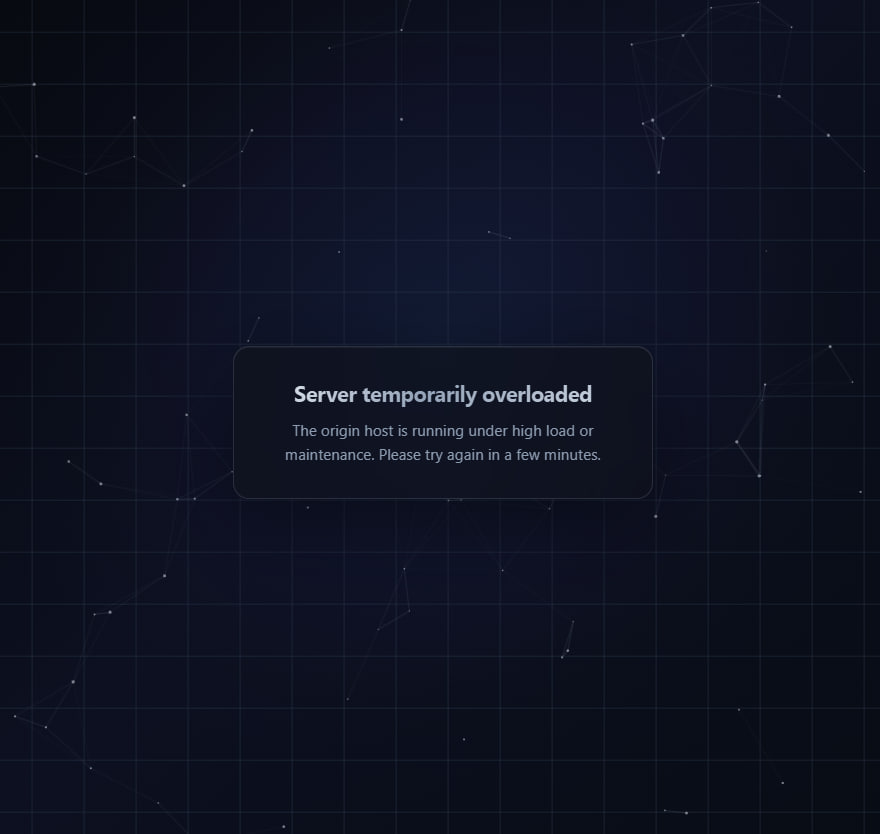

---

### 2. Вход в панель
> Безопасная авторизация для вашего спокойствия.

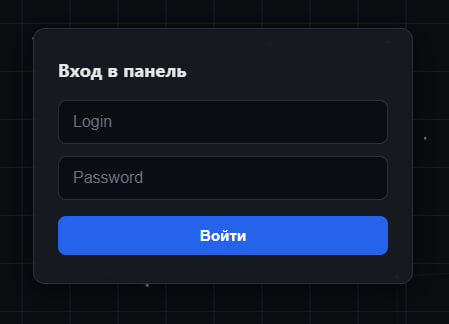

---

### 3. Главная страница панели
> Ваши серверы и основные показатели — всё на виду.

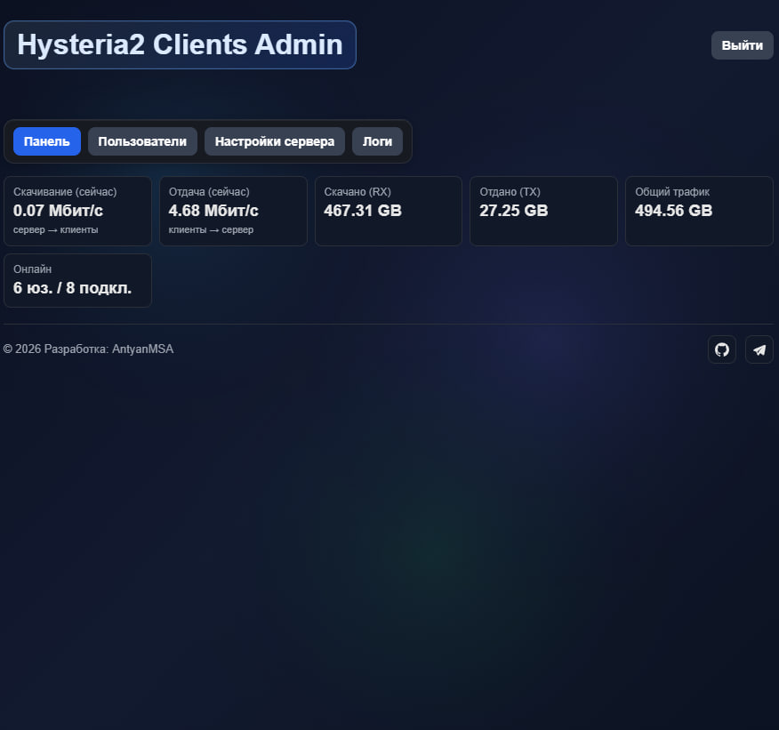

---

### 4. Создание нового пользователя
> Добавляйте пользователей в пару кликов.

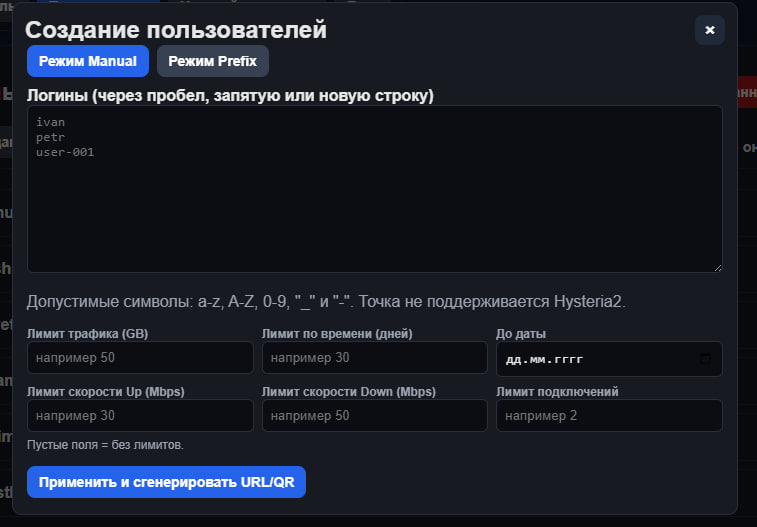

---

### 5. Управление пользователями
> Список всех пользователей и быстрые действия над ними.

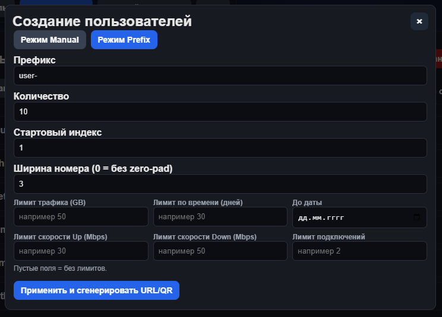

---

### 6. Информация о клиенте и её изменение
> Детальная информация для каждого клиента — с возможностью редактирования.

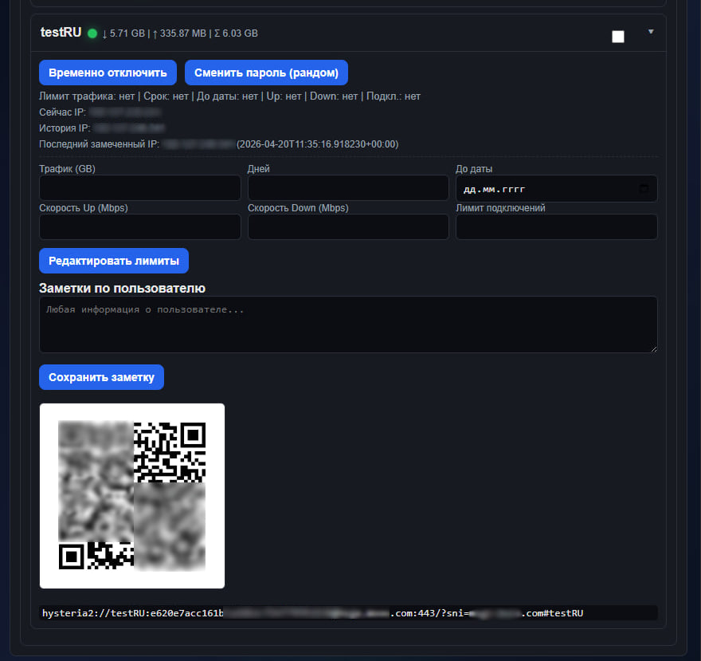

---

### 7. Настройка срока действия/времени для пользователя
> Гибкая настройка времени доступа прямо в интерфейсе.

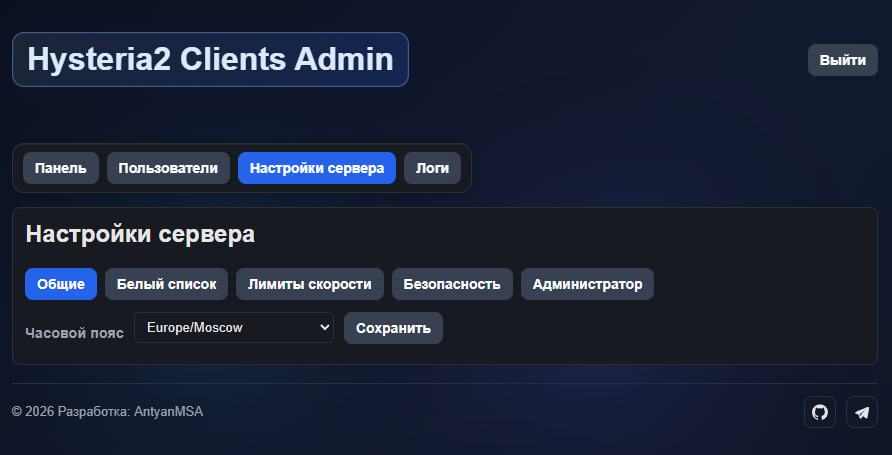

---

### 8. Белый список IP (whitelist)
> Управляйте списком доверенных IP-адресов одним кликом.

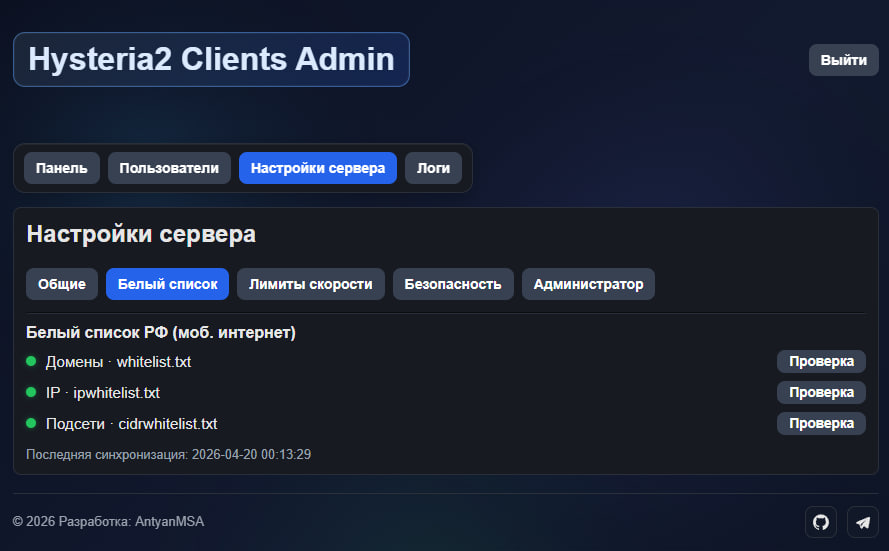

---

### 9. Ограничение скорости соединения
> Легко задавайте лимиты скорости для пользователей.

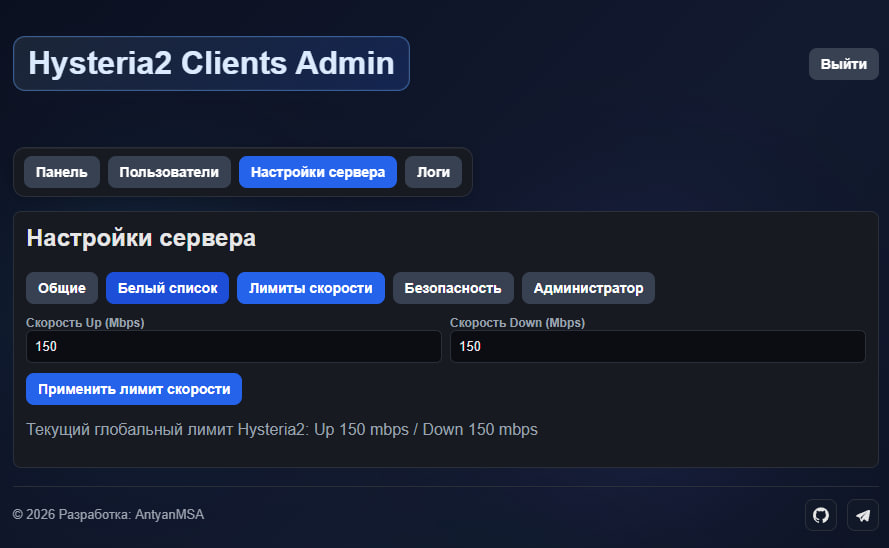

---

### 10. Интеграция с Fail2Ban — работа с белым списком
> Безопасность под контролем: управление Fail2Ban прямо из панели.

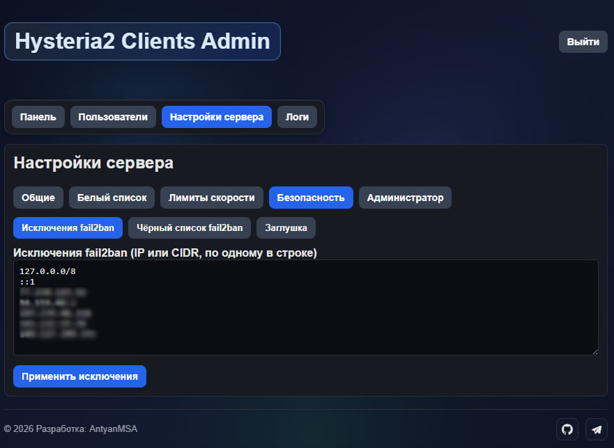

---

### 11. Jail'ы Fail2Ban
> Просматривайте и управляйте состоянием jail-ов Fail2Ban.

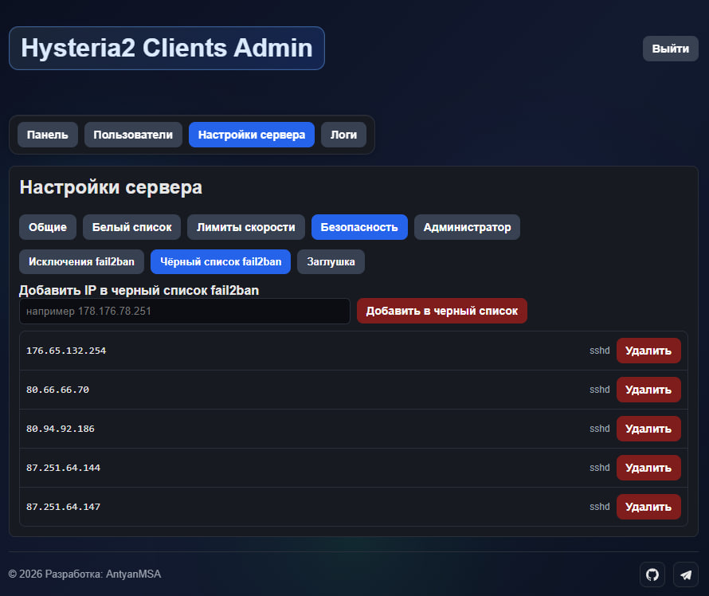

---

### 12. Создание plug-конфигов
> Генерируйте готовые плагины для подключения клиентов.

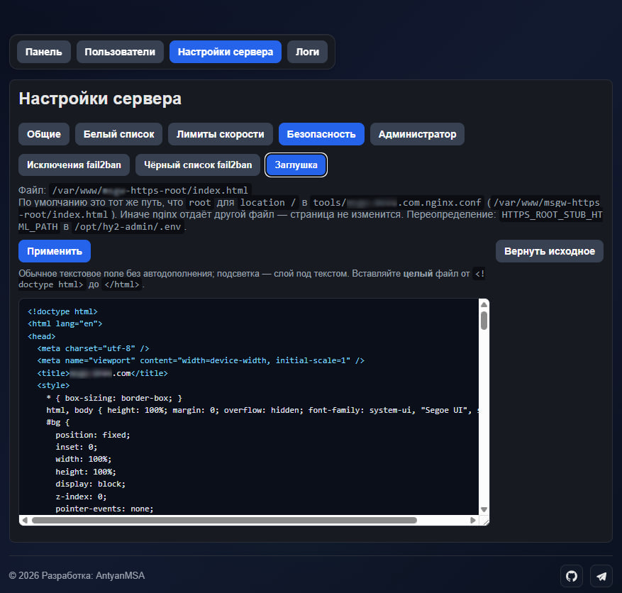

---

### 13. Настройки администратора и особый секретный адрес панели
> Управляйте важными параметрами и доступами безопасно.

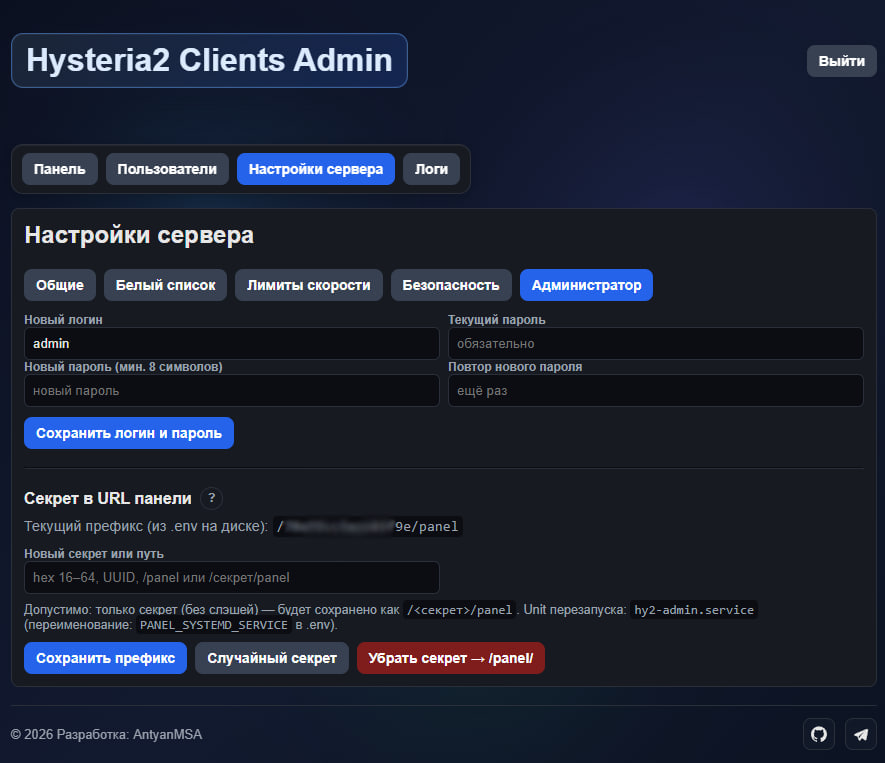

---

### 14. Просмотр текущих логов
> Следите за действиями в системе в реальном времени.

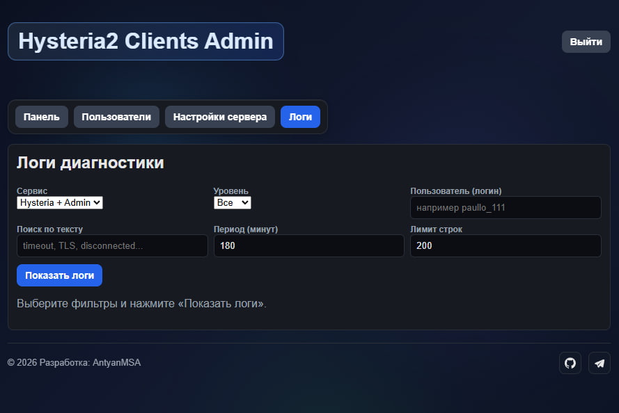

---

### 15. Журнал действий и история логов панели
> Вся история операций в одном месте — прозрачность и удобство аудита.

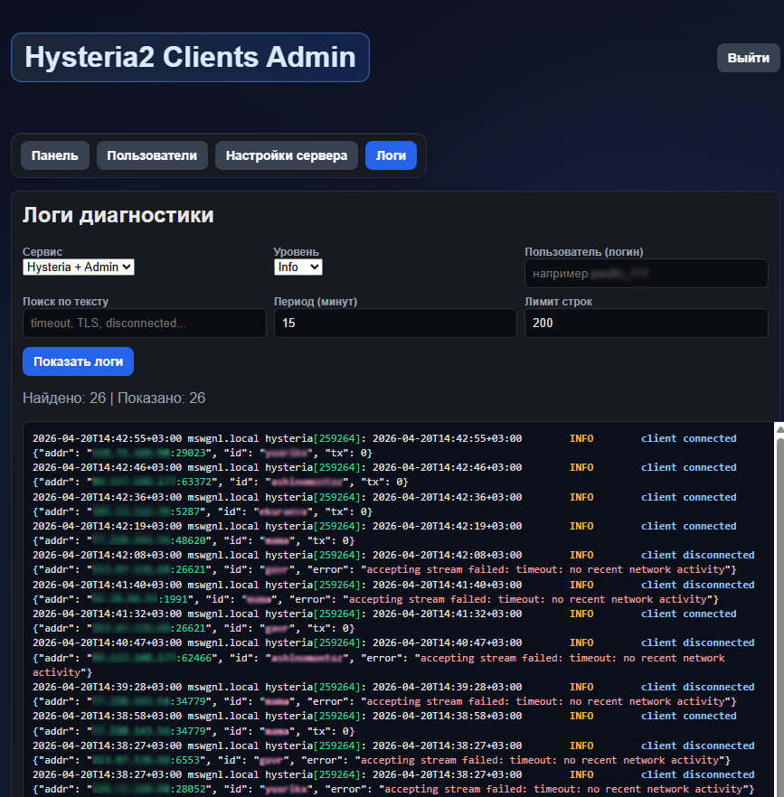

---

>**HY2 Admin** — всё под контролем и всегда наглядно!